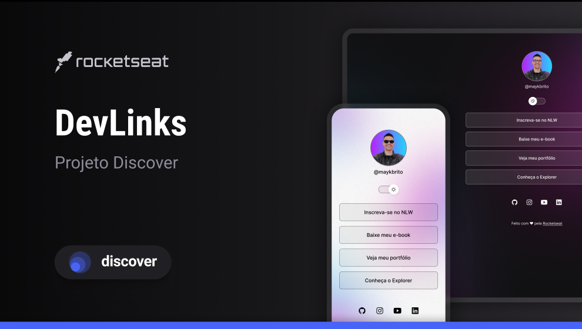

# DevLinks Japa 🚀

Projeto desenvolvido durante o **Discover da Rocketseat**, com personalização própria no visual e identidade única.

Uma página de links estilo **Linktree**, moderna e responsiva, criada para centralizar redes sociais, portfólio, cursos e conteúdos em um só lugar.

---

## 📸 Preview

 
---

## ✨ Funcionalidades

- ✅ Layout moderno e responsivo  
- ✅ Tema Dark / Light Mode  
- ✅ Links personalizados  
- ✅ Ícones de redes sociais  
- ✅ Hover effects suaves  
- ✅ Estrutura limpa e organizada  

---

## 🛠️ Tecnologias utilizadas

- HTML5  
- CSS3  
- JavaScript  
- Git & GitHub

---

## 🎯 Objetivo do projeto

Praticar fundamentos do desenvolvimento web, como:

- Estruturação com HTML  
- Estilização com CSS  
- Manipulação de tema com JavaScript  
- Responsividade  
- Versionamento com Git

---

## 🚀 Acesse o projeto online

🔗 https://SEU-LINK-AQUI.com

*(depois substitui pelo link do GitHub Pages ou Vercel)*

---

